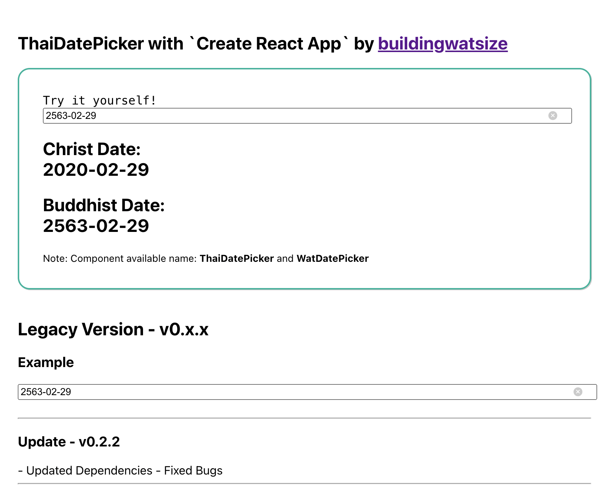

# Demo with create-react-app template

## About

This is a demo website to show how to use `thaidatepicker-react` package with `create-react-app` template, which is the legacy version of this package.

## Table of Contents

- [Demo with create-react-app template](#demo-with-create-react-app-template)
  - [About](#about)
  - [Table of Contents](#table-of-contents)
  - [Template contains](#template-contains)
  - [Get started](#get-started)
  - [Screenshot](#screenshot)

## Template contains

- [x] React 18
- [x] create-react-app

## Get started

> Note: Please make sure the parent project has `dist` directory for local package. Run the command below if it doesn't exist.
>
> ```bash
> # Run this command inside root directory `thaidatepicker-react`
> 
> # install dependencies first
> yarn
> 
> # `yarn start` if debug is needed.
> yarn build
> ```

1. Install dependencies

   ```bash
   # Run this command inside `thaidatepicker-react/example/with-create-react-app`
   yarn
   ```

2. Run

   ```bash
   yarn start
   ```

3. Demo will appear on website [http://localhost:3000/](http://localhost:3000/)

## Screenshot



🌈 Made with ❤️ by Watsize 🌈
