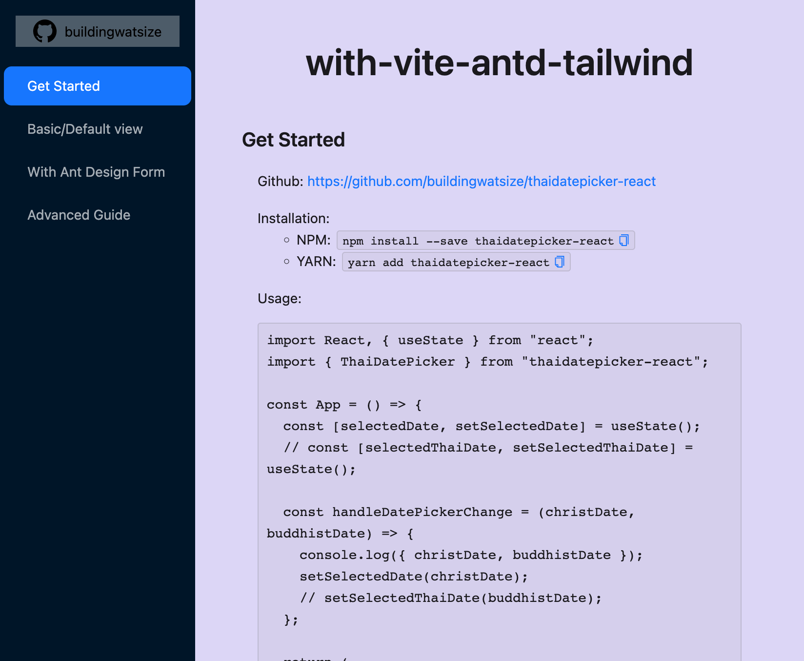

# ⚡ thaidatepicker-react demo ⚡

## 📘 About

This is a demo website to show how to use `thaidatepicker-react` package with `vite`, `tailwindcss`, and `ant-design`. I hope this demo will be an answer for all of the question / issues in the future.

## 📝 Table of Contents

- [⚡ thaidatepicker-react demo ⚡](#-thaidatepicker-react-demo-)
  - [📘 About](#-about)
  - [📝 Table of Contents](#-table-of-contents)
  - [📦 Template contains](#-template-contains)
  - [☝️ Get started](#️-get-started)
  - [🖼️ Screenshot](#️-screenshot)

## 📦 Template contains

- [x] React 18
- [x] Vite (build tool)
- [x] TailwindCSS (for className utils completeness)
- [x] Ant Design CSS (for Component "plug-n-play")

## ☝️ Get started

> Note: Please make sure the parent project has `dist` directory for local package. Run the command below if it doesn't exist.
>
> ```bash
> # Run this command inside root directory `thaidatepicker-react`
> 
> # install dependencies first
> yarn
> 
> # `yarn start` if debug is needed.
> yarn build
> ```

1. Install dependencies

   ```bash
   # Run this command inside `thaidatepicker-react/example/with-create-react-app`
   yarn
   ```

2. Run

   ```bash
   yarn dev
   ```

3. Demo will appear on website [http://localhost:5173/](http://localhost:5173/)

## 🖼️ Screenshot



🌈 Vite Template – Made with ❤️ by Watsize 🌈
